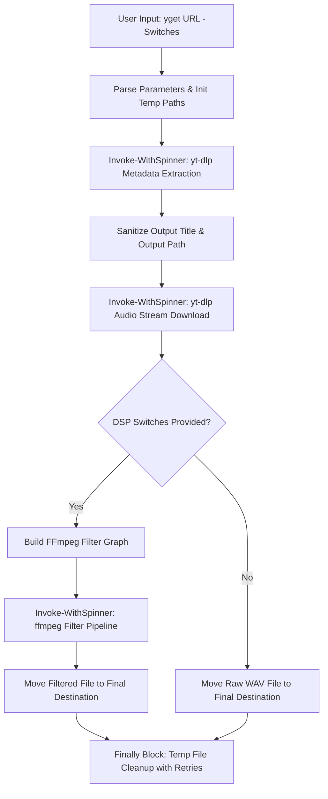

# Ps1YouTube

An asynchronous, colorized PowerShell audio extraction and DSP pipeline powered by `yt-dlp` and `ffmpeg`.

## Overview

`yget.ps1` downloads audio streams from YouTube URLs, extracts high-quality WAV files, and applies real-time DSP audio filters (pitch modulation, vibrato, flanger, tremolo, phase reversal) with smooth non-blocking terminal spinners.

## Key Features

- **Asynchronous Terminal Spinner**: Direct `.NET` process event handlers stream process pipes without pipeline buffer deadlocks.
- **Colorized Output**: Standard console indicators (`[*]`, `[+]`, `[!]`, `[-]`).
- **Handle Safety**: Explicit process handle disposal and retry loops in `finally` blocks prevent stream locking.
- **DSP Audio Filter Chain**:
  - `-Funky`: Sine pitch modulation & vibrato (`vibrato`, `apulsator`).
  - `-Wobble`: Stereo flanger effect with dynamic feedback (`flanger`).
  - `-Pulsate`: LFO tremolo amplitude modulation (`tremolo`).
  - `-Reverse`: Full audio phase/buffer reversal (`areverse`).

## Architecture & Workflow

